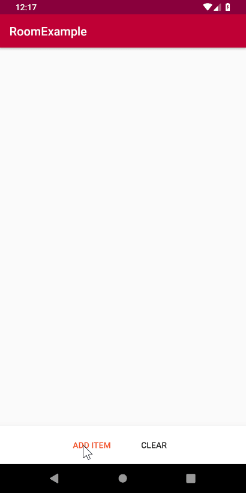

# Room Example
A little example about ROOM and LiveData

## Summary
- MVVM pattern
- LiveData
- Coroutines:
    - ViewModelScope
    - Suspend function on the DAO interface
    - Retrofit async
- Arrow (Either and Try)

## Screenshots
